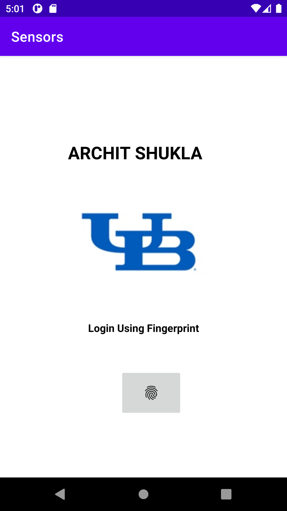

# Sensor Testing Android App

This Android application is designed for testing sensors such as accelerometer,gyroscope etc. in mobile devices. The app is developed using Android Studio to showcase sensor testing and Android app development.

## Features

- Test gyroscope sensor functionality.
- Test magnetometer sensor functionality.
- Test Gravity sensor functionality.
- Test Proximity sensor functionality.
- Test light sensor by creating a feature which dims the brightness according to the light in the room.
- Test accelerometer sensor by creating a feature which counts steps.
- Test Biometric systems by unlocking the application on the home page.
- User-friendly interface for sensor testing.
- Real-time sensor data visualization.
- Compatibility with a wide range of Android devices.

## Getting Started

1. Clone the repository to your local machine.
2. Open the project in Android Studio.
3. Build and run the app on an Android device or emulator.
4. Navigate through the app's interface to test the sensors.

## App Screenshots

